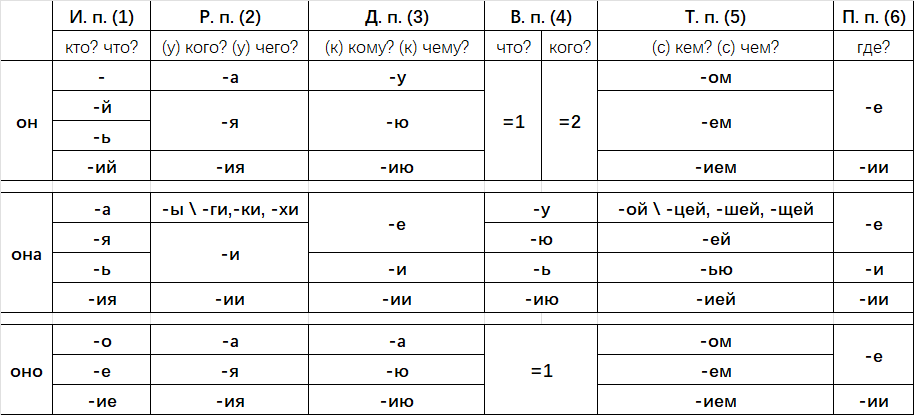

# 名词

существительное(сущ.)

## 名词变复数

### 变化规律

| 一般情况 | 单数 | 复数 | 举例 |
|---|---|---|---|
| он | -  | -ы | стол → столы |
| она | -а | -ы | лампа → лампы |
|  | -я | -и | аудитория → аудитории |
| оно | -о | -а | окно → окна |
|  | -е | -я | море → моря |

| 特殊末尾 | он\она\оно | они |  |
|---|---|---|---|
|  | -й\ь | -и |  |
|  | -к-\г-\х- | -ки\ги\хи |  |
|  | -ж-\ш-\ч-\щ- | -жи\ши\чи\щи |  |

### 记忆：变复数特殊变化词语

|  | они |
|---|---|
| брат | братья |
| друг | друзья |
| стул | стулья |
| сестра| сёстры |
| дом | дома |
| город | города |
| глаз | глаза |
| человек | люди |
| ребёнок | дети |

### 描述物体数量

遵循[«数词+名词的格变化规则»](#数词名词的格变化规则)。

## 名词变格

### (1)主格(им.п.)

全称：именительный падеж  
提问：Кто? Что?

### (2)属格(род.п.)

全称：родительный падеж  
提问：  

- (у) Кого? (у) Чего? | 主语（谁？什么？）  
- Чей? Чья? Чьё?  
- Откуда?  
- Когда?  
- Сколько?  
- Где?  

| | кто/что | у кого/чего |
|---|---|---|
| он | | -а |
| | -ь/й | -я |
| она | -а | -ы |
| | -я | -и |
| | -ка/га/ха| -ки/ги/хи |
| оно | -о | -а |
| | -е | -я |

> 特殊变化：
> отец \- отца, мать \- матери, дочь \- дочери  
> время \- времени, деньги \- денег, часы \- часов  

#### У **кого(2)** есть/нет ...

У **кого(2)** *есть* **кто/что(1)**.  
> - У меня есть машина.  
> - У меня (есть) красивы/один брат. *(**Нет нужна есть** если прил здесь.)*

У **кого(2)** *нет* **кого/чего(2)**.  
> - У Федора(2) нет собаки/машины(2).

#### Из/с Откуда(2)

#### Чеи/чья/чьё/чьи? | 谁的？

#### Какой/какая/какое/какие?

> \- Какое это здание?  
> \- Это здание(1) *университета(2)*.
>
> \- Какои это проспект?  
> \- Это проспект(1) *Мира(2)*.  

> \- **Какая** это улица?  
> \- Это **улица(1)** *Дружны(2)*.  
>
> \- **Куда** ты ездил вчера?  
> \- Я ездил **на улицу(4)** *Дружны(2)*.  
>
> \- **Где** находится гостиница?  
> \- Гостиница находится **на улице(6)** *Дружны(2)*.  

### (3)与格(дат.п.)

全称：дательный падеж  
提问：(к) Кому? (к) Чему? | 所属，否定，部分数量  

| | кто/что | (к) кому/чему |
|---|---|---|
| он | | -у |
| | -й/ь | -ю |
| | -ий | -ию |
| она | -а/я | -е |
| | -ь | -и |
| | -ия | -ии |
| оно | -о | -у |
| | -е | -ю |
| они | -ы | -ом |
| | -и | -ям |
| | -ги | -гам |

> 特殊变化：
> отец \- отцу, мать \- матери, дочь \- дочери
> папа \- папе
> ребёнка \- ребёнку

#### 区分是否有连接词 к

- к кому:
(1) 表示方向性（去谁那里/向谁），类似“to”；
(2) 固定搭配，например, *подойти к кому*.
- кому
(1) 表示间接对象（给谁/对谁）；
(2) дать, помочь, писать, говорить
(3) 固定搭配，*например, сказать кому*.

#### 动词接格 кому(3)

| НСВ/СВ **\+ что(4) кому(3).** | 释义 |
|---|---|
| давать/дать | gave sth. to sb. |
| покупать/купить | bought sth. for sb. |
| дарить/подарить | send sth. as a gift to sb. |
| читать/прочитать | 给谁读什么 |
| показывать/показать| 拿出什么给谁看 | 
| писать/написать | 给谁写什么 |
| рассказывать/рассказать | 给谁叙述什么 |
| посылать/послать | 给谁寄/发送什么 |

| НСВ/СВ **\+ кого(4) кому(3).** | 释义 |
|---|---|
| представлять/представить | |

| НСВ/СВ **\+ кому(3).** | 释义 | 注 |
|---|---|---|
| звонить/позвонить | | |
| помогать/помочь | | |
| отвечать/ответить | | |
| рассказать | | |
| сказать | | |
| показать | | |
| пригласить | | |
| попросить | | |
| спросить | | |

#### Кому(3) нравится что/кто(1)

#### Кому(3) сколько лет? | 问年龄

#### Кому(3) весело/холодно/жарко/интересно/скучно/...

#### Кому(3) надо/нужно ...

### (4)宾格(вин.п)

全称：винительный падеж  
提问：Кого? Что? | 间接对象（给谁？对什么？）  

### (5)工具格(тв.п.)

全称：творительный падеж  
提问：(с) Кем? (с) Чем? | 直接宾语（动作承受者）  

#### 动词接格 (с) кем/чем(3)

| НСВ/СВ **\+ кого(4) с кем(5).** | 释义 |
|---|---|
| знакомить/познакомить | |

#### Кто с кем(5)

#### Кто любить что(4) с кем(5)

#### Кто будет/был/работать кем(5) | 从事...职业

#### Кто ... чем(5)

### (6)前置格(пред.п.)

全称：предложный падеж  
提问：О ком? О чём? Где? | 工具，方式，被动动作执行者  

## 数词+名词的格变化规则

Склонение существительных при числительных.  

| 1 + 单数1格 | 2, 3, 4 + 单数2格 | 5-20 + 复数2格 |
|---|---|---|
| рубль | рубля | рублей |
| час | часа | часов |
| минута | минуты | минут |
| год | года | лет |
| стол | стола | столов |
| раз | раза | раз |
| градус | градуса | градусов |

> 历史原因（古斯拉夫语遗留）  
在古俄语中，数字 2-4 被认为是「双数」（двойственное число）的残留形式，双数要求名词用单数第二格；数字 5+ 则被视为真正的复数，因此用复数第二格。

根据后接名词的性，[数字1和2对应的俄语发生变化](数字_序数词.md/#数词12随后接名词的性而变化rules_1_2)。

## 人称代词

### 谁

| кто(1) | кого(2) | кому(3) | кого(4) | кем(5) | (6) |
|---|---|---|---|---|---|
| я | меня | мне | меня | мной | обо мне |
| ты | тебя | тебе | тебя | тобой | о тебе |
| он/оно | его | ему | его | им | о нём |
| она | её | ей | её | ею | о ней |
| мы | нас | нам | нас | нами | о нас |
| вы | вас | вам | вас | вами | о вас |
| они | их | им | их | ими | о них |

### 谁的

#### падеж 1

| (1) | чей | чья | чьё | чьи |
|---|---|---|---|---|
| я | мой | моя | моё | мои |
| ты | твой | твоя | твоё | твои |
| он/оно | его | его | его | его |
| она | её | её | её | её |
| мы | наш | наша | наше | наши |
| вы | ваш | ваша | ваше | ваши |
| они | их | их | их | их |
|| ничьё|||

#### падеж 6

| (6) | чём (он/оно) | (она) | (они) |
|---|---|---|---|
| я | моём | моей |  |
| ты | твоём | твоей |  |
| он/оно |  |  |  |
| она |  |  |  |
| мы | нашем | нашей |  |
| вы | вашем | вашей |  |
| они |  |  |  |

### 自己的（反身物主代词）

> 反身物主代词“自己的”，必须与主语人称一致，并根据所修饰的名词的性、数、格进行变化。

| падеж | он | она | оно | они |  |
|---|---|---|---|---|---|
| (1) | свой | своя | своё | свои |  |
| (2) | своего | своей | своего | своих | кого? чего? |
| (3) | своему | своей | своему | своим | кому? чему? |
| (4) | свой/своего | свою | своё | своих | кого? что? |
| (5) | своим | своей | своим | своими | кем? чем? |
| (6) | своём | своей | своём | своих | о ком? о чём? в/на где? |

> *Например:* 
> 
> Я пишу в **моей** тетради. **=** *Я* пишу в **своей** тетради.  
> Ты пишешь в **твой** тетради. **=** *Ты* пишешь в **своей** тетради.
>   
> Петя пишет в **своей** тетради(а) **!=** Петя пишет в **его** тетради(б).
> > В это пример, (а) -- тетради Пети, (б) -- тетради **не** Пети.  
> 
> Маша думает о **своей** маме(а). **!=** Маша думает о **её** маме(б).
> > В это пример, (а) -- мама Маши, (б) -- мама **не** Маши.

> 句子需要有明确主语时才能使用反身物主代词。
> 错误：Это своей сад. 

## 名词变形容词

| 词尾[+он] | +он | +она | +оно | +они | сущ. |
|---|---|---|---|---|---|
| -ый | новый | новая | новое | новые | новое |
| -ой | родной | родная | родное | родные | родные |
| -ий | синий | синяя | синее | синие |  |
| 特殊词尾 |  |  |  |  |  |
| -к\г\х- | маленький | маленькая | маленькое | маленькие |  |
| -ш\ж\ч\щ- | хороший | хорошая | хорошее | хорошие |  |
|  | большой | большая | большое | большие |  |
